# Amazon Q Business for Retail Intelligence - AI-Powered Retail Intelligence Platform for Comprehensive Business Analytics

Amazon Q Business for Retail Intelligence is a comprehensive retail analytics platform that empowers decision-makers with real-time insights and predictive analytics across the entire retail value chain. The platform integrates AWS QuickSight for data visualization, Q Business for intelligent querying, and CloudFront for content delivery to provide actionable insights for retail operations.

The platform offers integrated analytics modules covering product performance, sales trends, inventory management, customer sentiment, marketing effectiveness, and vendor relationships. It leverages AWS services to process retail data from multiple sources and presents insights through an intuitive web interface with interactive dashboards and AI-powered query capabilities.

## Repository Structure
```
deployment-automation/
├── cfn-templates/                    # CloudFormation templates for AWS infrastructure
│   ├── asset_s3_bucket_creation.yaml # Creates S3 bucket for data assets with versioning
│   ├── qbusiness_creation_template.yaml # Sets up Q Business application with IAM roles
│   ├── quicksight_creation_template.json # Configures QuickSight data sources and datasets
│   └── static-web-hosting.yaml      # Creates S3 and CloudFront for web hosting
├── code/                            # Python automation scripts
│   ├── qbiz.py                      # Common helper functions
│   ├── create_qapps.py              # Creates Q Apps deployment
│   ├── delete_qapps.py              # Deletes Q Apps deployed
│   ├── list_qapps.py                # Show a list of the Q Apps deployed
│   ├── update_qapps.py              # Replaces all deployed Q Apps deployment
│   ├── process_html_templates.py    # Updates templates with URLs of the currently deployed
│   │                                # QApps and uploads the files to CloudFront
│   ├── export_quicksight_bundle.py  # Exports QuickSight dashboards
│   ├── import_quicksight_bundle.py  # Imports QuickSight configurations
│   └── q_app_details*.json          # Q Apps configuration files
├── manifest_templates/              # Jinja 2 templates for data source S3 manifests
│   ├── demand_*.json.j2             # QS Demand forecasting dataset configurations j2 templates
│   ├── marketing_performance.json.j2 # QS Marketing metrics dataset location j2 template
│   ├── sales_data.json.j2           # QS Sales dataset configuration j2 template
│   └── segment_*.json.j2            # QS Segment dataset configurations j2 templates
├── html_templates/                  # Jinja 2 templates for html files
│   └── retail-qbizapp.html.j2       # Main application portal interface HTML j2 template
└── static/                          # Static web assets for the final portal
    └── retail-qbizapp.css           # Main application CSS style sheet
```
Note that the *_quicksight_bundle.py files are included for reference. Since we already
exported the sample data from QuickSight you will not need to execute these.

## Usage Instructions
### Prerequisites
- AWS Account with administrative access
- AWS CLI installed and configured
- Python 3.7 or higher
- AWS QuickSight Enterprise Edition subscription
- AWS Q Business enabled in your account
- Identity Center (formerly AWS SSO) configured
- AWS Quicksight, Q Business and IDC in the same AWS Region

### Installation

1. Clone the repository and set up environment:
```bash
git clone https://github.com/aws-samples/sample-amazon-qbusiness-and-quicksight-for-retail-intelligence.git
cd sample-amazon-qbusiness-and-quicksight-for-retail-intelligence
```

2. Deploy infrastructure:
```bash
# Deploy S3 bucket for assets
aws cloudformation deploy --template-file cfn-templates/asset_s3_bucket_creation.yaml --stack-name retail-iq-data-assets

# Wait for stack creation to complete, then get outputs
aws cloudformation describe-stacks \
  --stack-name retail-iq-data-assets \
  --query 'Stacks[0].Outputs[*].[OutputKey,OutputValue]' \
  --output table

# This will set the created bucket into the environment variable QBIZ_ASSET_BUCKET_NAME
export QBIZ_ASSET_BUCKET_NAME=$(aws cloudformation describe-stacks \
  --stack-name retail-iq-data-assets \
  --query 'Stacks[0].Outputs[*].[OutputKey,OutputValue]' \
  --output text | grep --color=never -o -E 'qbiz-asset-[0-9]+')

# Make sure the environment variable matches the S3 bucket from
# the table
echo $QBIZ_ASSET_BUCKET_NAME
```

Now that we have the asset bucket name we can create the manifest files
with the proper information. These files are used to create sample data
within QuickSight
```bash
python code/process_manifest_templates.py
```

Copy the sample data and the manifest files to S3
```bash
aws s3 cp csv s3://$QBIZ_ASSET_BUCKET_NAME --recursive
aws s3 cp manifest s3://$QBIZ_ASSET_BUCKET_NAME --recursive

# Deploy Q Business infrastructure. You can access your Identity Center
# web console at: https://us-east-1.console.aws.amazon.com/singlesignon/home
# Please make sure this is your valid email address
export IDC_USER_NAME='username@example.com'
# This should match your Identity Center ARN
export IDC_SSO_ARN='arn:aws:sso:::instance/ssoins-XXXXXXXXXXX'
aws cloudformation deploy --template-file cfn-templates/qbusiness_creation_template.yaml --parameter-overrides IDCUserName=${IDC_USER_NAME}  IDCInstanceArn=${IDC_SSO_ARN} --stack-name retail-iq-qbusiness --capabilities CAPABILITY_NAMED_IAM

# Wait for stack creation to complete, then get outputs
aws cloudformation describe-stacks \
  --stack-name retail-iq-qbusiness \
  --query 'Stacks[0].Outputs[*].[OutputKey,OutputValue]' \
  --output table

# Let's get a reference to the formation S3 bucket name for
# use downstream
export QBIZ_FORMATION_BUCKET_NAME=$(aws cloudformation describe-stacks \
  --stack-name retail-iq-qbusiness \
  --query 'Stacks[0].Outputs[*].[OutputKey,OutputValue]' \
  --output text | grep --color=never -o -E '\sqbiz-cloudformation-.+' | tr -d '[:blank:]')
echo $QBIZ_FORMATION_BUCKET_NAME


# Once this cloudformation stack is successfully deployed, please open the newly created Q business application in the AWS console and add users from IDC in-order for them to get access to the application

# Deploy QuickSight resources
aws cloudformation deploy \
  --template-file cfn-templates/quicksight_creation_template.json \
  --stack-name retail-iq-quicksight --s3-bucket $QBIZ_ASSET_BUCKET_NAME \
  --parameter-overrides S3AssetBucket=${QBIZ_ASSET_BUCKET_NAME}
```

Go to the QuickSight console 
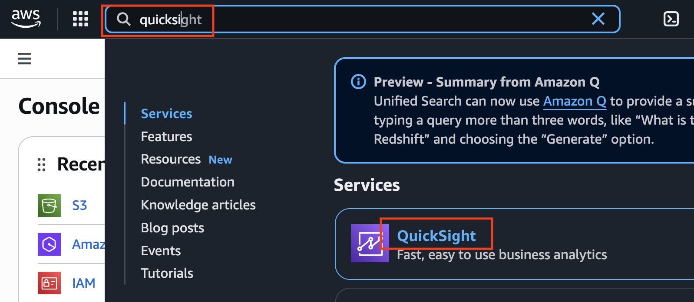

Then log into QuickSight
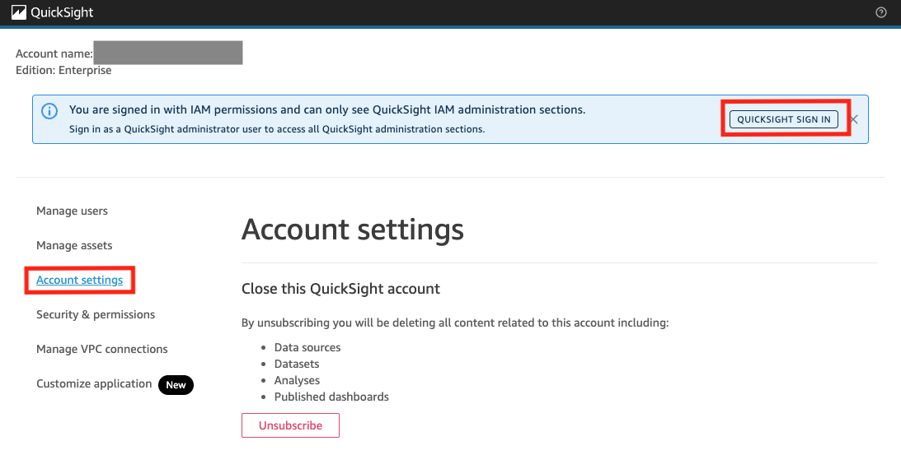

```bash
# Deploy static website hosting
aws cloudformation deploy \
  --template-file cfn-templates/static-web-hosting.yaml \
  --stack-name retail-iq-web

# Wait for stack creation to complete, then get outputs
aws cloudformation describe-stacks \
  --stack-name retail-iq-web \
  --query 'Stacks[0].Outputs[*].[OutputKey,OutputValue]' \
  --output table

# Let's store more values in environment variables so that
# we can use them when handling templates.
export QBIZ_CLOUDFRONT_BUCKET_NAME=$(aws cloudformation describe-stacks \
  --stack-name retail-iq-web \
  --query 'Stacks[0].Outputs[*].[OutputKey,OutputValue]' \
  --output text | grep --color=never -o -E 'retail-.+')
echo $QBIZ_CLOUDFRONT_BUCKET_NAME

export QBIZ_CLOUDFRONT_FQDN=$(aws cloudformation describe-stacks \
  --stack-name retail-iq-web \
  --query 'Stacks[0].Outputs[1].[OutputValue]' \
  --output text)
echo $QBIZ_CLOUDFRONT_FQDN

```

### Quick Start
1. Once "retail-iq-qbusiness" stack is successfully deployed, open the newly created Q business application in the AWS console and add users from IDC in-order for them to get access to the application

2. Add the CloudFront URL from "retail-iq-web" stack output(CloudFrontDomainName) in both Q Business and Quicksight to whitelist it for embedding


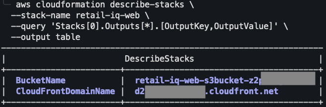

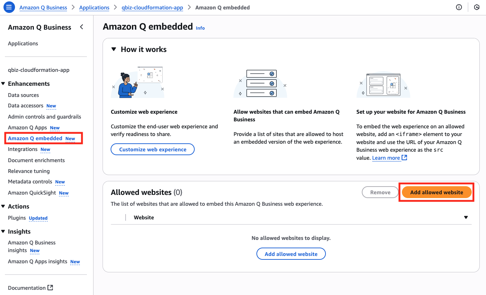

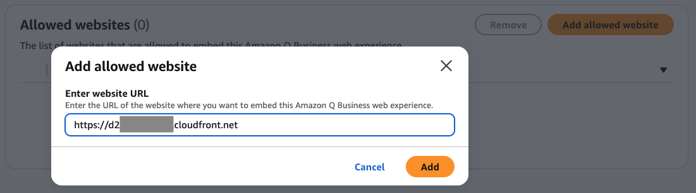


Go to the QuickSight console 


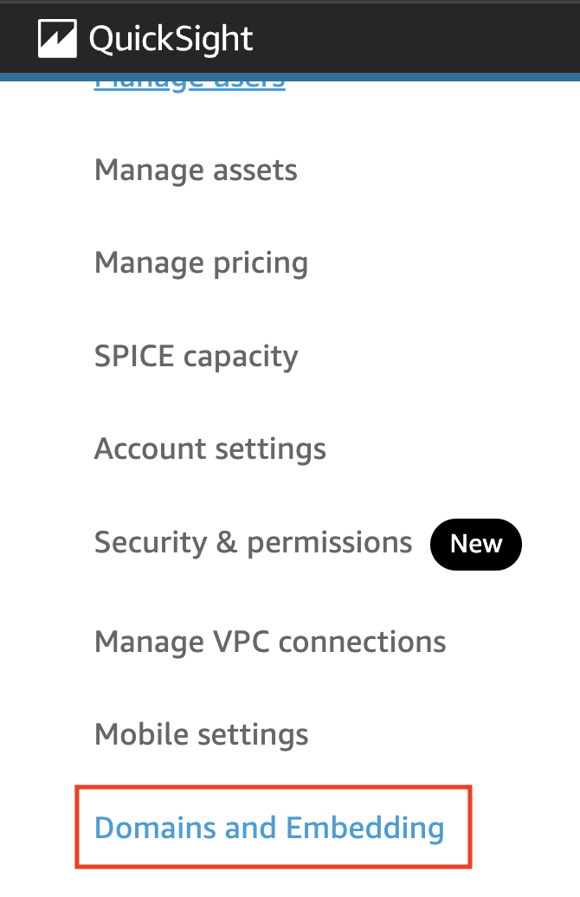


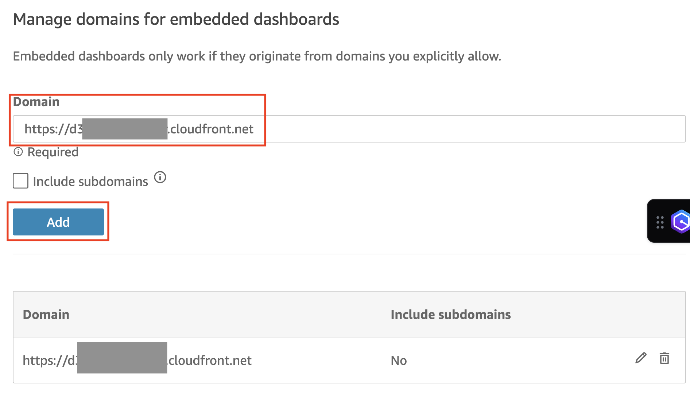


3. Share the newly created assets in Quicksight with the IDC user

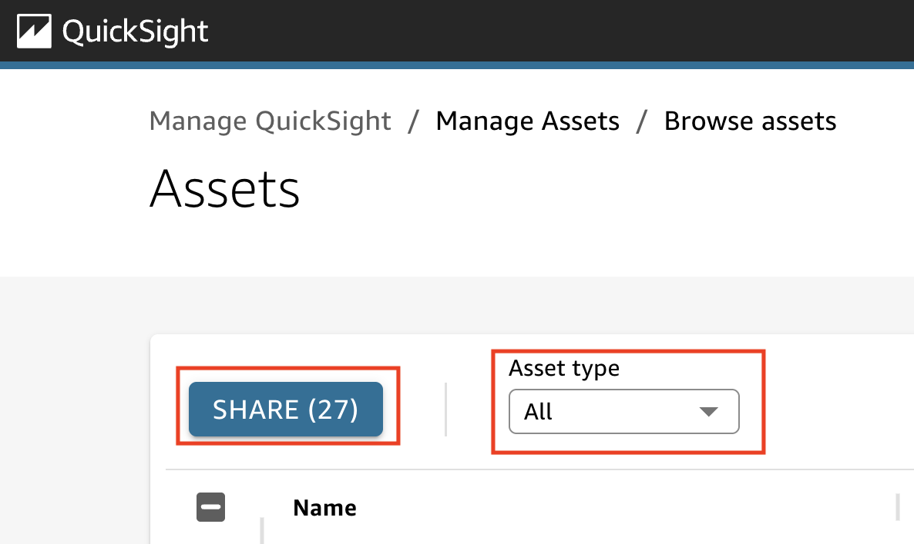

Share the assets with all the QuickSight groups that need access. In out case we 
have 2 groups: QuickSightAdmins and QuickSightUsers

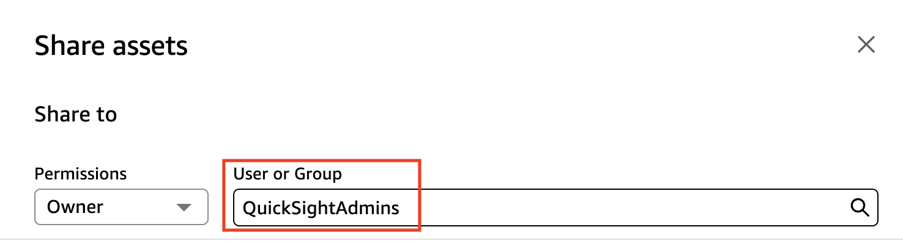

4. Configure the AWS credentials in credentials.json
```bash
cp credentials.json.template credentials.json
```
To get the proper credentials, open a chrome browser to the deployment URL, and right click 
somewhere on the page. Select inspect, go to the Network tab, and refresh the page.

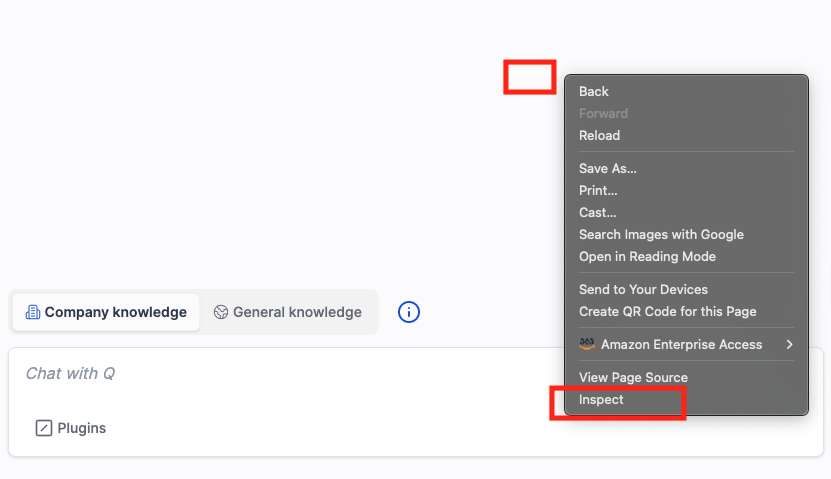

You should see a `credentials` file. Right click on the

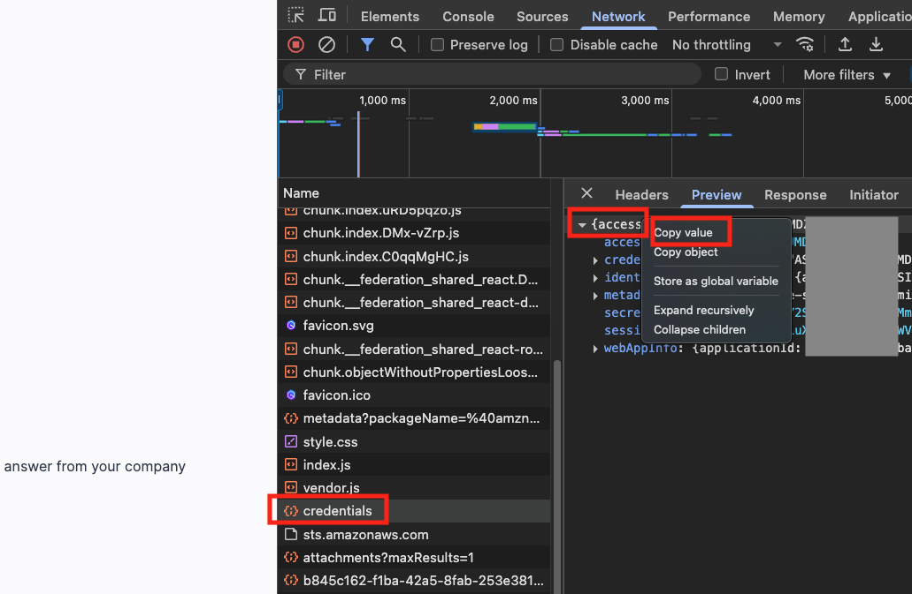

5. Deploy Q Apps:
```bash
python code/create_qapps.py
```

6. Update and publish the CloudFront files
```bash
python code/process_html_templates.py
```

7. Access the application through the CloudFront URL provided in the "retail-iq-web" stack outputs. The URL pattern would be https://XXXXXXXXXXXXXX.cloudfront.net/retail-qbizapp.html

8. Copy data to S3 and sync the data sources
This is an optional step, but if you want to be able to start asking questions in Q Business
you'll need some data indexed.

We have included data used to record the demo video with the exception of the PDFs created
while searching the web. We can't include those files to avoid copyright issues.

To copy the other sample files do the following:
```bash
aws s3 cp extras/qbiz-application-ds s3://$QBIZ_FORMATION_BUCKET_NAME/qbiz-application-ds --recursive
aws s3 cp extras/s3-claude-set1 s3://$QBIZ_FORMATION_BUCKET_NAME/s3-claude-set1 --recursive
aws s3 cp extras/s3-web-search-set1 s3://$QBIZ_FORMATION_BUCKET_NAME/s3-web-search-set1 --recursive
```

Now that we have some data to index, let's trigger a data source sync

Let's take a look again at the ids for the index and data sources
```bash
aws cloudformation describe-stacks \
  --stack-name retail-iq-qbusiness \
  --query 'Stacks[0].Outputs[*].[OutputKey,OutputValue]' \
  --output table
```

This should show a list similar to this one:

```
-------------------------------------------------------------------------------------------------------------------------------------
|                                                          DescribeStacks                                                           |
+---------------+-------------------------------------------------------------------------------------------------------------------+
|  DataSource1Id|  6cb56500-xxxx-xxxx-xxxx-xxxxxxxxxxxx|0324bbb4-xxxx-xxxx-xxxx-xxxxxxxxxxxx|38f1a6d9-xxxx-xxxx-xxxx-xxxxxxxxxxxx   |
|  DataSource2Id|  6cb56500-xxxx-xxxx-xxxx-xxxxxxxxxxxx|ad77bf07-xxxx-xxxx-xxxx-xxxxxxxxxxxx|38f1a6d9-xxxx-xxxx-xxxx-xxxxxxxxxxxx   |
|  IndexId      |  6cb56500-xxxx-xxxx-xxxx-xxxxxxxxxxxx|38f1a6d9-xxxx-xxxx-xxxx-xxxxxxxxxxxx                                        |
|  DataSource3Id|  6cb56500-xxxx-xxxx-xxxx-xxxxxxxxxxxx|dd82987c-xxxx-xxxx-xxxx-xxxxxxxxxxxx|38f1a6d9-xxxx-xxxx-xxxx-xxxxxxxxxxxx   |
|  S3BucketArn  |  arn:aws:s3:::qbiz-cloudformation-xxxxxxxxxxxx                                                                    |
|  S3BucketName |  qbiz-cloudformation-xxxxxxxxxxxx                                                                                 |
|  ApplicationId|  6cb56500-xxxx-xxxx-xxxx-xxxxxxxxxxxx                                                                             |
+---------------+-------------------------------------------------------------------------------------------------------------------+
```
Notice that the first part of the DataSourceXId rows match the data in ApplicationId. Also, the last part of the DataSourceXId rows match the data in IndexId. Where they are unique is in the middle.

Where they are unique is in the middle.

In our case these are the commands to do a data source sync on all 3 data sources:
```bash
aws qbusiness start-data-source-sync-job --application-id 6cb56500-xxxx-xxxx-xxxx-xxxxxxxxxxxx --index-id 38f1a6d9-xxxx-xxxx-xxxx-xxxxxxxxxxxx --data-source-id 0324bbb4-xxxx-xxxx-xxxx-xxxxxxxxxxxx

aws qbusiness start-data-source-sync-job --application-id 6cb56500-xxxx-xxxx-xxxx-xxxxxxxxxxxx --index-id 38f1a6d9-xxxx-xxxx-xxxx-xxxxxxxxxxxx --data-source-id ad77bf07-xxxx-xxxx-xxxx-xxxxxxxxxxxx

aws qbusiness start-data-source-sync-job --application-id 6cb56500-xxxx-xxxx-xxxx-xxxxxxxxxxxx --index-id 38f1a6d9-xxxx-xxxx-xxxx-xxxxxxxxxxxx --data-source-id dd82987c-xxxx-xxxx-xxxx-xxxxxxxxxxxx
```

### More Detailed Examples
1. Creating custom Q Apps:
```python
# Edit q_app_details.json with your app configuration
{
    "title": "Custom Analysis App",
    "description": "Custom analytics application",
    "initialPrompt": "Show analysis for...",
    "appVersion": 1,
    "status": "PUBLISHED"
}
```

2. Configuring data sources:
```json
{
    "fileLocations": [{
        "URIs": ["s3://your-bucket/path/to/data.csv"]
    }]
}
```

### Troubleshooting
1. Q Apps Deployment Issues
- Error: "Q Apps already exists"
  - Solution: Delete existing apps first using AWS Console
  - Debug: Enable verbose logging in create_q_apps.py
  - Check Q Business service role permissions

2. QuickSight Integration
- Error: "Unable to access S3 data source"
  - Verify S3 bucket permissions
  - Check QuickSight service role
  - Validate manifest file format

3. Web Interface Access
- Error: "Access Denied"
  - Verify CloudFront distribution settings
  - Check S3 bucket policy
  - Validate SSL certificate configuration

## OPTIONAL: Custom plugins (sending orders to the Distribution Center)
This step is optional and enables advanced features not required for the demo.

One of the features of Q Business is the execution of custom plugins. This mechanism allows integration with 3rd party systems and enables Q Business users to take actions in those systems.

To showcase this, we are going to demonstrate how store managers can ask Q Business to generate a weekly order and then send it to the distribution center for processing.

This requires configuring an email address in Amazon Simple Email Service. If you don't have this configured take a look at the section: Configuring an email address in Amazon Simple Email Service

Let's create a new lambda function that will handle sending the email. Go to the lambda console.

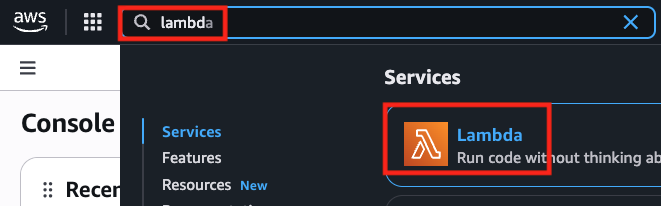

Create a function:

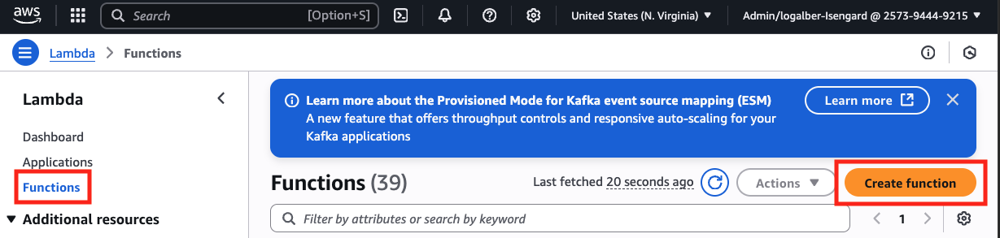

We'll create the function from scratch and use the current version of python.

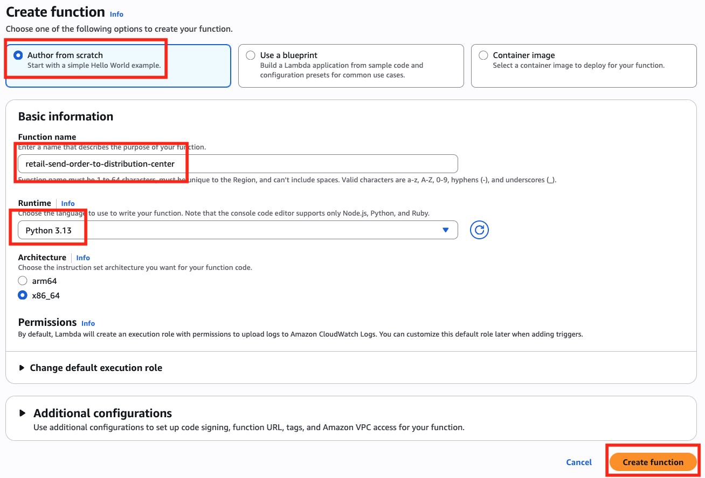

Once we have the function, we'll configure the email addresses used with environment variables. Let's add them:

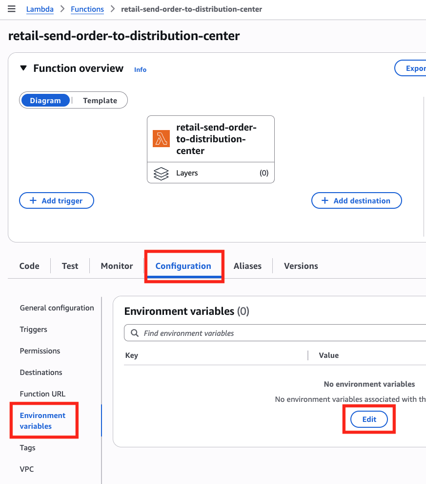

Set the source email address and the destination address. These will represent the distribution center. Note that these addresses have already been added as identities in Amazon Simple Email Service.:

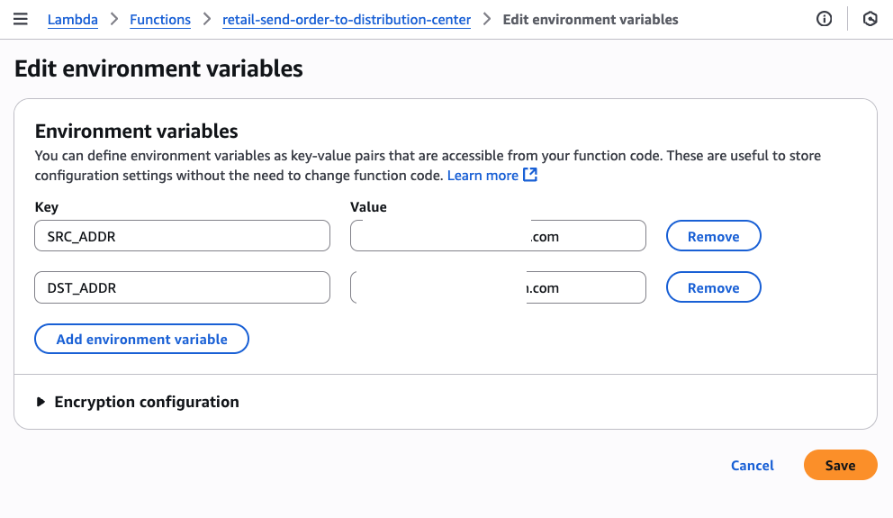

With the environment variables configured, let's add the function code and deploy it. You can find the example code in `extras/code/lambda_retail-send-order-to-distribution-center.py`:

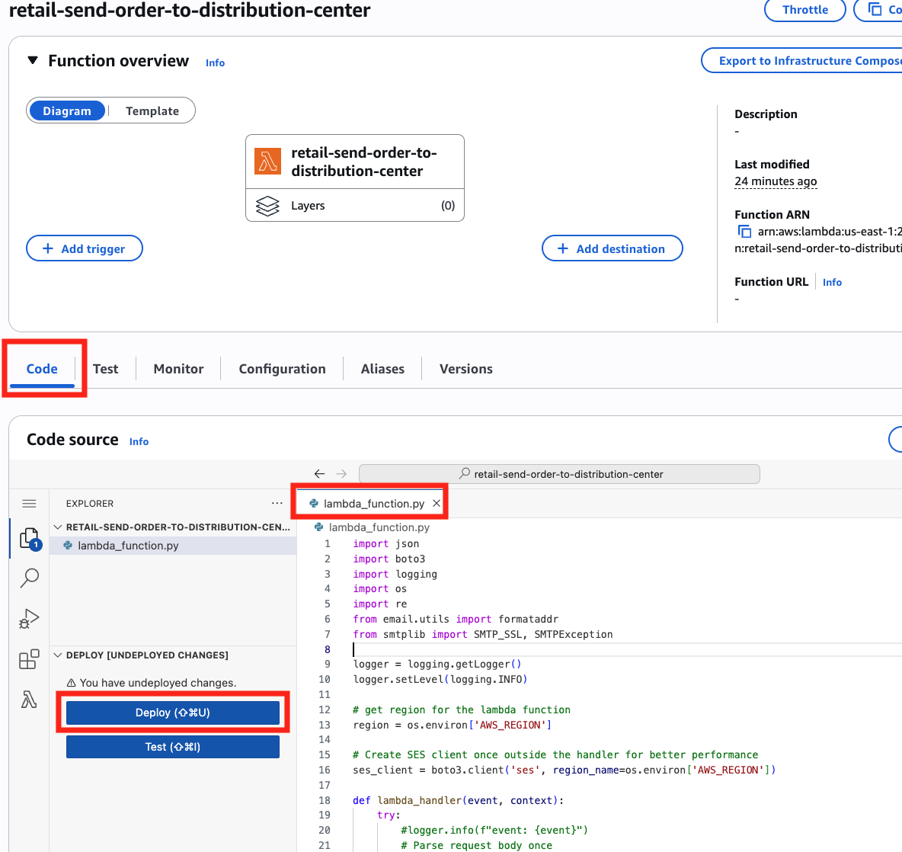

The function is going to need permissions to send the email to the identity. Go to the Configuration Permissions section and click on the square that will open the execution role in a new tab:

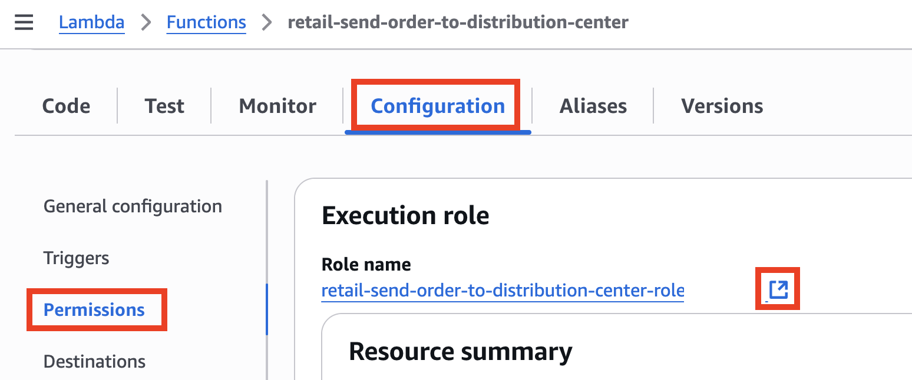

Add permissions and create an inline policy:

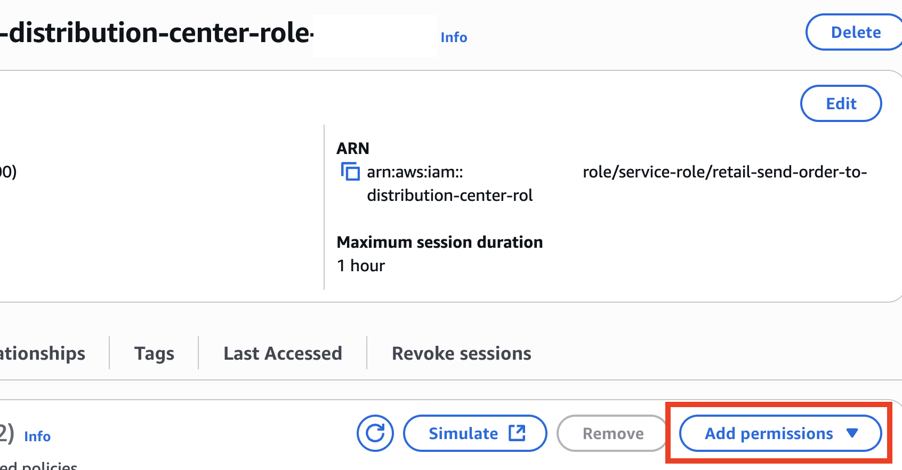

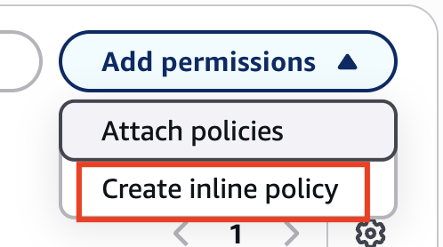

This is what the policy should look like. Make sure you replace the resource arn with the value from your Simple Email Service identity you want to receive the emails.

```json
{
    "Version": "2012-10-17",
    "Statement": [
        {
            "Sid": "VisualEditor2",
            "Effect": "Allow",
            "Action": [
                "ses:SendEmail",
                "ses:SendTemplatedEmail",
                "ses:SendRawEmail"
            ],
            "Resource": "arn:aws:ses:us-east-1:XXXXXXXXXXXX:identity/YYYYYYYYYYYY"
        }
    ]
}
```
save it and call it send_email.

For Q Business to call our lambda, we need an API gateway. We'll deploy a very simple one for this example. Before you go into production, we recommend you integrate Cognito authentication to better protect the API. You can find such documentation in this [AWS blog](https://aws.amazon.com/blogs/machine-learning/set-up-a-custom-plugin-on-amazon-q-business-and-authenticate-with-amazon-cognito-to-interact-with-backend-systems/)

For the demo, we protect the API gateway by ensuring there is a unique path that is random and has a length larger than most passwords or API keys. This path will be used within the OpenAPI specification. 

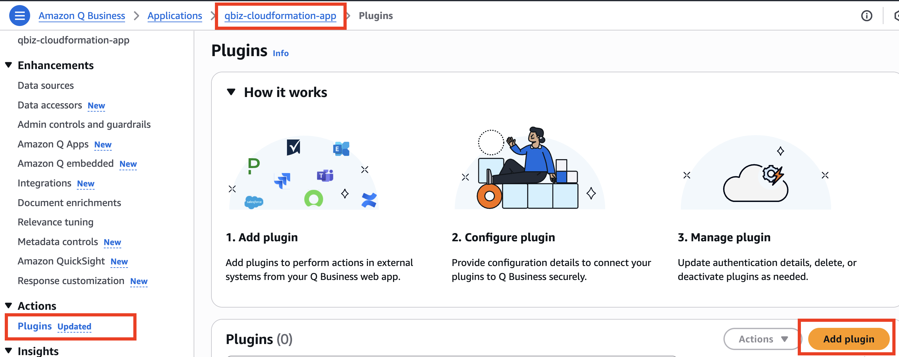

Let's add the openapi spec file from `extras/code/lambda_openapi_spec.yaml`. Note that we are going to have to replace the server URL with the one where the API gateway is deployed and the path with the endpoint we created with a random suffix:

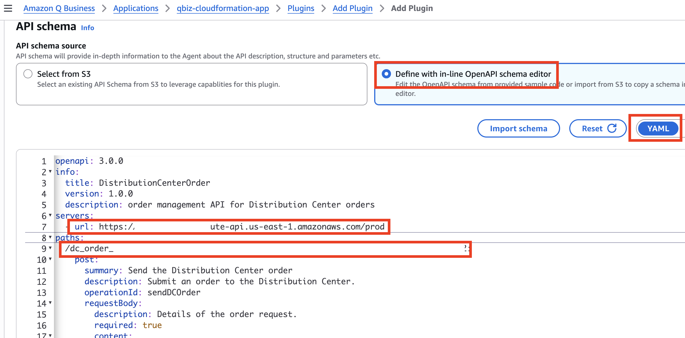

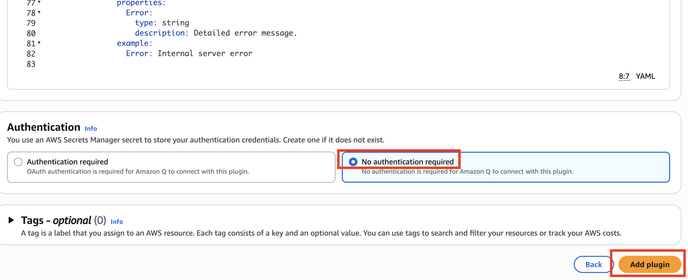

That's it, your custom plugin will now be able to send emails to the distribution center. Explore other capabilities and don't forget to remove the plugin once you are done with experimentation.


## Configuring an email address in Amazon Simple Email Service

To setup an email address to send/receive email via Amazon Simple Email Service you will need to create it as an identity: 

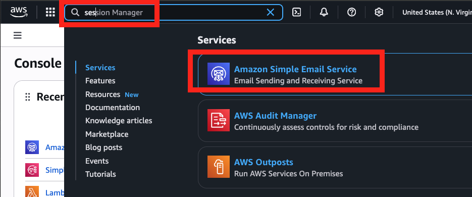

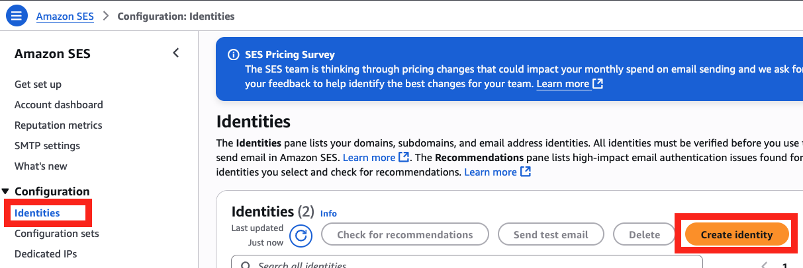

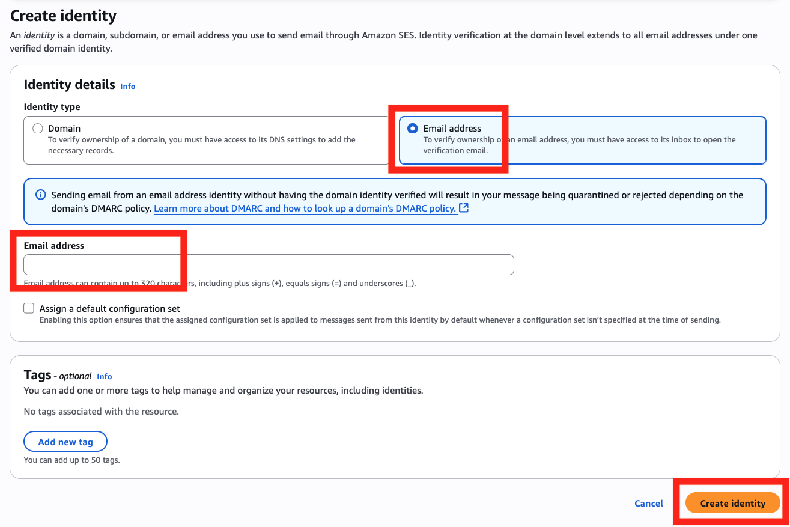

Once you've added the email address a verification link will be sent. When you receive it, go ahead and click on the long URL. This will verify the address and allow it to send and receive properly.

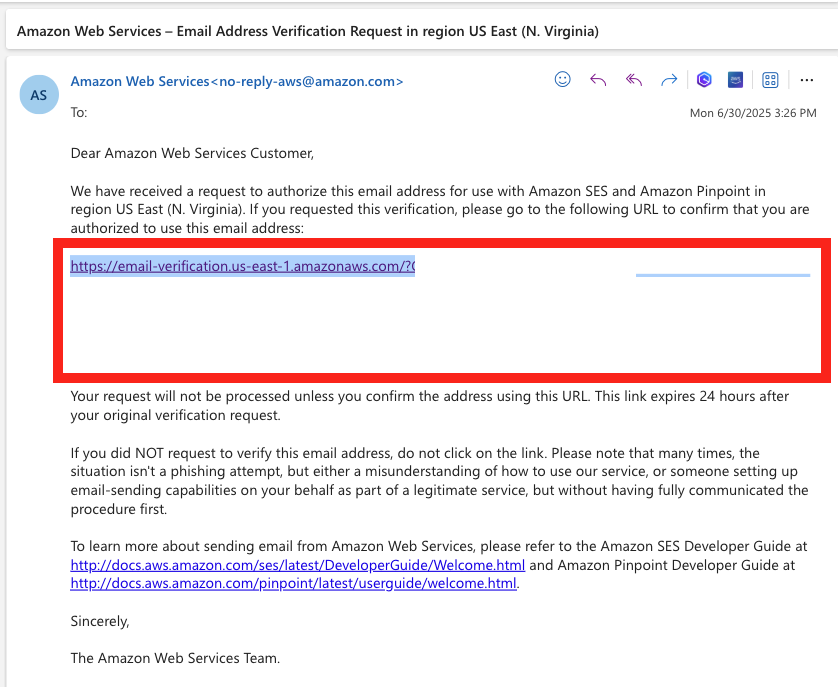


## Data Flow
The platform processes retail data through multiple AWS services to generate insights.

```ascii
[S3 Buckets] --> [QuickSight] --> [Dashboards]
     |              |                   |
     v              v                   v
[Q Business] --> [Analysis] --> [Web Interface]
```

Key component interactions:
1. Data ingestion through S3 buckets with versioning
2. QuickSight processes and visualizes data using SPICE engine
3. Q Business provides natural language querying capabilities
4. CloudFront delivers web interface with low latency
5. IAM roles manage secure service interactions

## Infrastructure

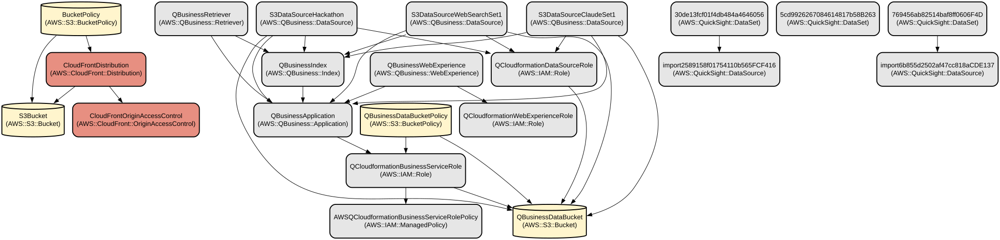
AWS Resources:
- S3:
  - QBusinessDataBucket: Versioned bucket for application data
  - StaticWebBucket: Hosts web interface files

- IAM:
  - QCloudformationBusinessServiceRole: Q Business service role
  - QCloudformationWebExperienceRole: Web interface role
  - QCloudformationDataSourceRole: Data access role

- QuickSight:
  - DataSources: S3-based data sources for analytics
  - DataSets: Configured datasets with transformations

- CloudFront:
  - Distribution: Delivers web interface content
  - OriginAccessControl: Secures S3 access

## Architecture

The platform offers integrated analytics modules covering product performance, sales trends, inventory management, customer sentiment, marketing effectiveness, and vendor relationships. It leverages AWS services to process retail data from multiple sources and presents insights through an intuitive web interface with interactive dashboards and AI-powered query capabilities.

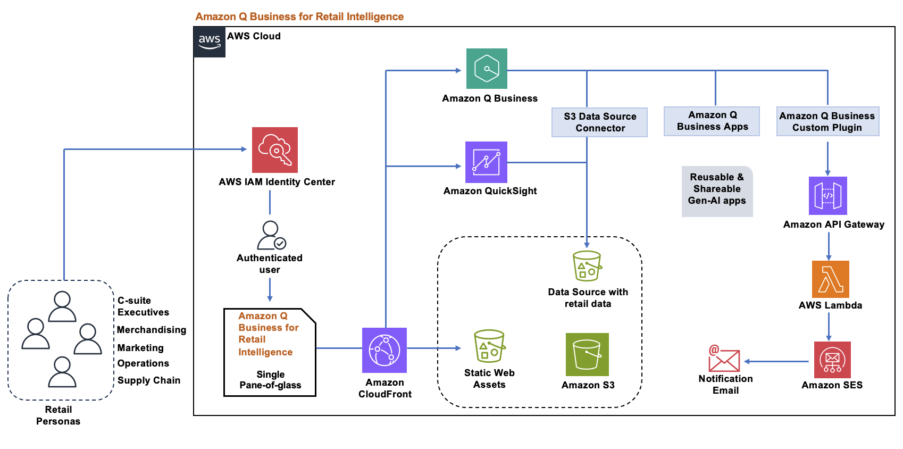


## Contributing

We welcome community contributions! Please see [CONTRIBUTING.md](CONTRIBUTING.md) for guidelines.

## Reporting security issues

Please refer to the [CONTRIBUTING](CONTRIBUTING.md#security-issue-notifications) document for information on how to report security issues. Do **not** create a public GitHub issue for security-related concerns.

## License

This library is licensed under the MIT-0 License. See the [LICENSE](./LICENSE) file.

